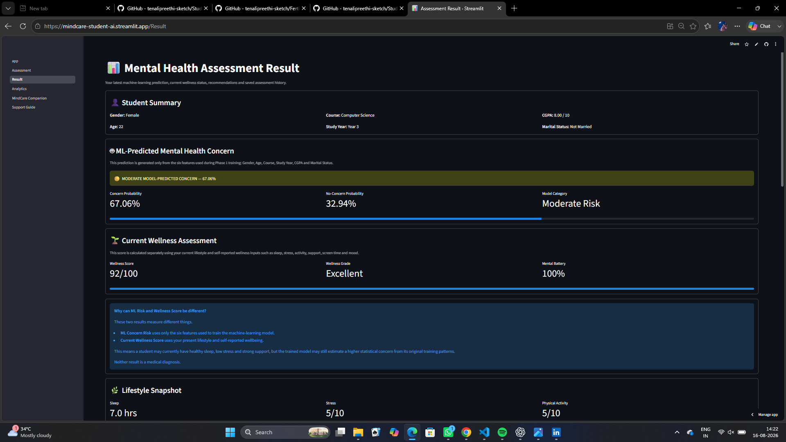
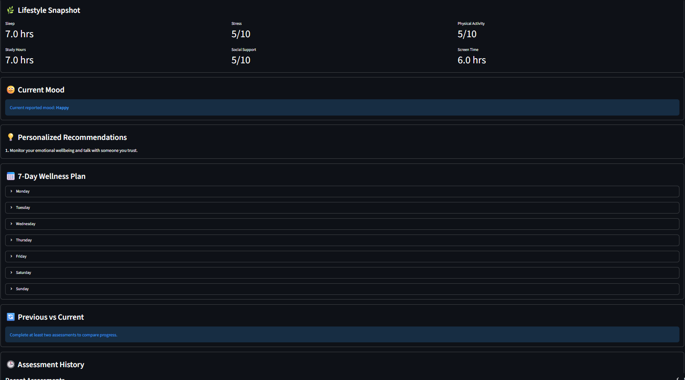
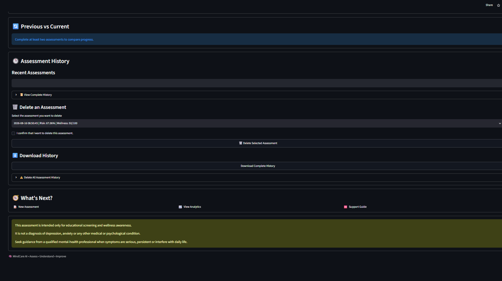

# 🧠 MindCare AI

## Student Mental Health Assessment & Wellness Support System

MindCare AI is a student-focused mental wellness platform that combines machine learning, wellness scoring, analytics, personalized recommendations, and an interactive companion chatbot in one application.

The system helps students understand their current mental-wellness risk, review lifestyle patterns, track assessment history, explore analytics, and interact with a friendly companion for relaxation, games, riddles, and casual support.

---

## ✨ Key Features

### 📝 Mental Health Assessment
Collects student profile information and current wellness-related inputs.

### 🤖 Machine Learning Prediction
Predicts mental-health concern probability using the trained machine-learning model.

The ML model currently uses:

- Gender
- Age
- Course
- Study Year
- CGPA Range
- Marital Status

### 🌱 Wellness Assessment
Calculates a separate wellness score using:

- Sleep hours
- Study hours
- Stress level
- Social support
- Physical activity
- Screen time
- Anxiety-related concerns
- Depression-related concerns
- Sleep difficulties
- Current mood

### 📊 Result Dashboard
Displays:

- ML concern probability
- No-concern probability
- Risk category
- Wellness score
- Wellness grade
- Mental battery
- Lifestyle snapshot
- Personalized recommendations
- 7-day wellness plan

### 🔄 Progress Tracking
Supports:

- Previous vs current assessment comparison
- Recent assessment history
- Complete assessment history
- Individual history deletion
- Complete history deletion
- CSV history download

### 📈 Analytics
Provides visual insights into wellness and assessment trends.

### 🤖 MindCare Companion
A friendly interactive companion designed for both wellness support and relaxation.

Features include:

- Casual English and Roman-Telugu conversation
- Mood-aware responses
- Emoji-based mood interaction
- Relaxation exercises
- Study motivation
- Assessment result explanation
- Telugu movie guessing
- Emoji movie guessing
- Riddles
- Logic challenges
- Mini mysteries
- Rapid fire
- Would You Rather
- Random fun questions
- Score and streak tracking
- Hint and skip support
- No-repeat question tracking during a session

### 🆘 Support Guide
Provides general student-friendly wellness and support guidance.

---

## 🛠️ Technologies Used

- Python
- Streamlit
- Pandas
- NumPy
- Scikit-learn
- Joblib
- Matplotlib
- OpenPyXL
- ReportLab

---

## 📁 Project Structure

```text
Student_Mental_Health_Agent/
│
├── app.py
├── phase2_agent.py
├── requirements.txt
├── README.md
├── .gitignore
│
├── models/
│   └── student_mental_health_model.pkl
│
├── pages/
│   ├── 1_Assessment.py
│   ├── 2_Result.py
│   ├── 3_Analytics.py
│   ├── 4_MindCare_Companion.py
│   └── 5_Support_Guide.py
│
├── records/
├── reports/
│
└── utils/
    ├── __init__.py
    ├── app_helpers.py
    ├── game_data.py
    ├── report_generator.py
    └── styles.py
    ```
    ---

## 📸 Application Screenshots

### 🧠 ML Prediction & Wellness Assessment



### 🌱 Personalized Recommendations & 7-Day Wellness Plan



### 🕘 Assessment History

